 

[View the live project here.](https://yescoops.github.io/oh-baby/)

This is an intercative baby quiz called Oh Baby! It is designed to be responsive and accessible on a range of devices, making it easy to navigate for new and returning players.

---


---

## User Experience (UX)

-   ### User stories

    -   #### First Time Visitor Goals

        1. As a First Time Visitor, I want to easily understand the main purpose of the site and learn more about babies.
        2. As a First Time Visitor, I want to be able to easily navigate throughout the site to play the quiz.
        
    -   #### Returning Visitor Goals

        1. As a Returning Visitor, I want to play the quiz again.

    -   #### Frequent User Goals
        1. As a Frequent User, I want to see if I can improve on my previous attempts of the quiz and introduce it to other players. 

-   ### Design
    -   #### Colour Scheme
        -   The colour palette used (see below) is a playful, light palette that emphasises the playful nature of the site. All colours pass through AA and AAA accessibility for their respective requirements of text or background, however a change had to be introduced with the correct and incorrect answer classes as the off-white colour used for the text was failing validity. Changing this to a darker colour passed all necessary validations. 

        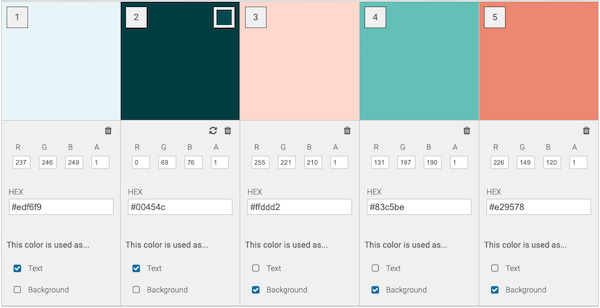
        
    -   #### Layout
        -  A simple page layout gives this site a clean, easy-to-use feel which creates the desired effect for the game. As the content focus is a basic quiz about babies, the uncluttered nature gives a sense of infancy and purity, like babies!
    -   #### Typography
        -   The Shadows into Light Too and Amatic SC fonts are the chosen fonts used throughout the whole website with Sans Serif as the fallback font in case for any reason the font isn't being imported into the site correctly. Both fonts have a playful, childlike feeling to them that suits the ethos of the page.
    -   #### Imagery
        -   Imagery is important. The large, background image of cartoon clouds used throughout highlights the playful and easy-going nature of the game. 

---

*   ### Wireframes

    -   Home Page Wireframe - 
    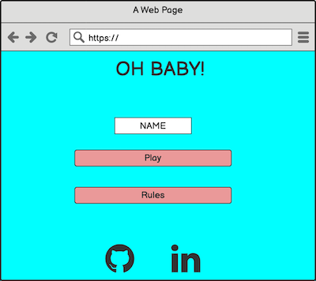

    -   Home Page Wireframe - 
    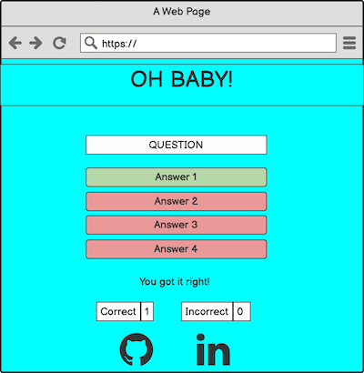

    -   Mobile Wireframe - 
    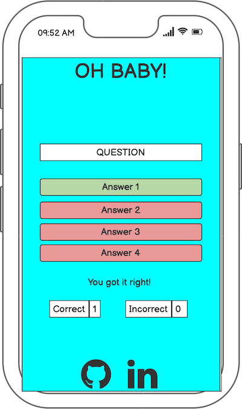

    -   Results Wireframe - 
    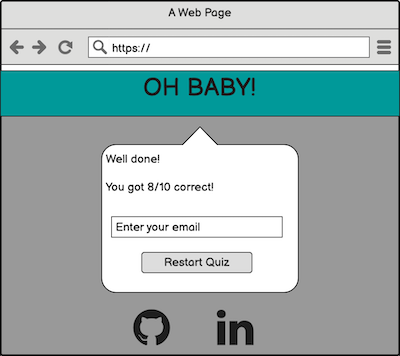 

    Due to the simplicity of the Site, no real changes neededed to be made from the inception of the Wireframes other than the removal of the email submit in the Results modal that I removed due to time constraints, which could be implemented at a later date. 

---

## Features

-   Responsive on all device sizes

-   Interactive elements

### Home Area
-   Identifies the purpose of the page and gives a clear understanding to the visitor what the purpose of the page is. An animated cloud scene, along with the simple button layout, highlights the fun, naive nature of the quiz. 
- An input field is there for a User to put their name in, which is then presented to them at the end of the game in the results modal. This gives the game a personal touch, enticing them to come back at a later date. 

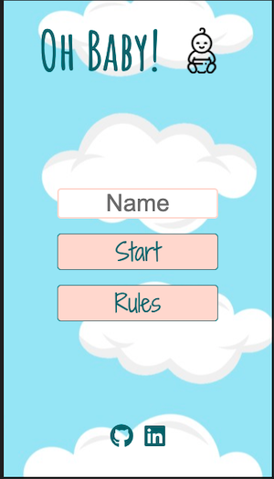

### Rules Modal

-   Clicking on this the User will be presented with the rules of the quiz. The use of a star icon rather than bullet points ties in with the baby-themed nature of what they are about to play. (Gold star anyone??)

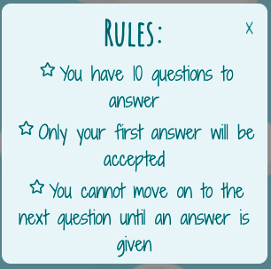

### Game Area
-   The simple layout of a question, four answer buttons and a score tally ties in with the baby-based nature of the quiz. 

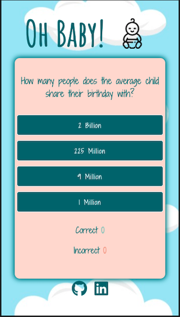

- When an answer is input, the User will get visual clarification of their answer with the relevant colours (the text will change colour to suit accessibility). If they are colourblind and cannot distinguish between red and green, the User will also get a message appear on the screen to let them know if they got it right or wrong. 

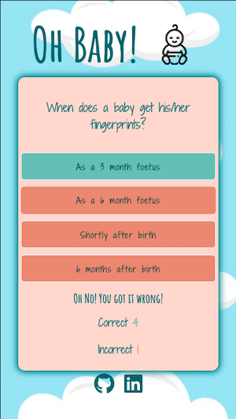

### Results Modal
- Once the game is completed and all 10 questions are answered, a results modal will show. 
- If a name has been input at the start of the game, they will see that appear after "Good job ___ !. Their score will also be displayed, with the option to restart the quiz if they wish.  

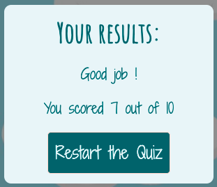


### Languages Used

-   [HTML5](https://en.wikipedia.org/wiki/HTML5)
-   [CSS3](https://en.wikipedia.org/wiki/Cascading_Style_Sheets)
-   [JavaScript](https://en.wikipedia.org/wiki/JavaScript)

### Frameworks, Libraries & Programs Used

1. [Google Fonts:](https://fonts.google.com/)
    - Google fonts were used to import the 'Shadows into Light Too' and 'Amatic SC' fonts into the style.css file which is used on all pages throughout the project.
1. [Font Awesome:](https://fontawesome.com/)
    - Font Awesome was used on all pages throughout the website to add icons for aesthetic and UX purposes.
1. [Git:](https://git-scm.com/)
    - Git was used for version control by utilizing the Gitpod terminal to commit to Git and Push to GitHub.
1. [GitHub:](https://github.com/)
    - GitHub is used to store the projects code after being pushed from Git.
1. [Balsamiq:](https://balsamiq.com/)
    - Balsamiq was used to create the [wireframes](https://github.com/) during the design process.
1. [Pexels:](https://pexels.com)
    - Pexels was used to provide some images for the Gigs and Connect sections of the build. 

---

## Testing

The W3C Markup Validator and CSS Validator Services were used to validate all pages of the project to ensure there were no syntax errors in there. JSHint was used to validate the Java Script with no errors highlighted. 

-   W3C Markup Validator - [Results for Main Page](https://validator.w3.org/nu/?doc=https%3A%2F%2Fyescoops.github.io%2Foh-baby%2F) 

-   W3C CSS Validator - [Results for Main Page](https://jigsaw.w3.org/css-validator/validator?uri=https%3A%2F%2Fyescoops.github.io%2Foh-baby%2F&profile=css3svg&usermedium=all&warning=1&vextwarning=&lang=en)

-   JSHint 

## Accessibility Testing

The site was throughly checked for any possible accessibility issues. Below is the [WAVE](https://wave.webaim.org/) report:

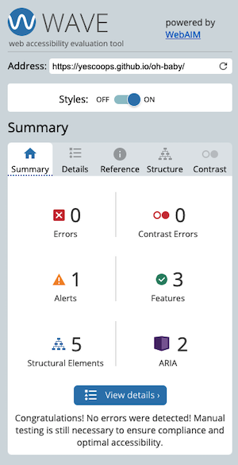

## Performance

The site was checked with Google Developments' Lighthouse tool. Below are the results:

- Main Page

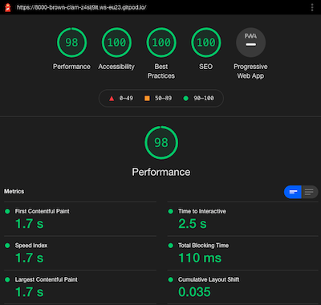

---

### Testing User Stories from User Experience (UX) Section

-   #### First Time Visitor Goals

    1. As a First Time Visitor, I want to easily understand the main purpose of the site and learn more about babies.

        1. Upon entering the site, users are automatically greeted with a clean and easily readable page, with a striking heading, logo and background that identify that this is a baby theme. 
        2. The main points are made immediately with the 'Start' and 'Rules' buttons.
        3. The user has two options, clicking the 'Start' and 'Rules' buttons, either of which gives them an understanding of what the purpose of the Site is. 

    2. As a First Time Visitor, I want to be able to easily navigate throughout the site to play the quiz.

        1. The site has been designed to be fluid and never to entrap the user. As a first user you will tend to go to the 'Rules' section first to gain an understanding of what the game entails. If not, they will click in to the Game and be presented with the first question in the Game Area.
        2. The user is unable to progress through the quiz without selecting an answer. The game will automatically move on to the next question after 1.5 seconds when an answer is submitted without the need to make any more clicks by the User. 
         

-   #### Returning Visitor Goals

    1. As a Returning Visitor, I want to play the quiz again.

        1. The user can go straight into a new game. The questions are randomised so the User will not experience the same questions on a second play. 
        2. At the end of the quiz the User is presented with their results and the option to restart the quiz. The idea of giving the User their results gives a light sense of competition. 

    2. As a Returning Visitor, I want to find the best way to get in contact with Matt with any booking or production requests I may have.

        1. The navigation bar clearly highlights the "Connect" section.
        2. Here they can fill out the form on the page or can follow the social links below the form.
     
    3. As a Returning Visitor, I want to find community links.
        1. The footer contains links to the organisations Instagram, Soundcloud and Mixcloud pages.
        2. Whichever link they click, it will be open up in a new tab to ensure the user can easily get back to the website.
       

-   #### Frequent User Goals

    1. As a Frequent User, I want to see if I can improve on my previous attempts of the quiz and introduce it to other players. 

        1. The user would already be comfortable with the website layout and can easily click the necessary buttons to play the game again.


### Further Testing

-   The Website was tested on Google Chrome, Firefox, Microsoft Edge and Safari browsers.
-   The Website was tested through Responsinator [(results here)](http://www.responsinator.com/?url=https%3A%2F%2Fyescoops.github.io%2Foh-baby%2F) to check any responsiveness issues. 
-   The website was viewed on a variety of devices such as Desktop, Apple Laptop, Oppo G13 mobile, iPhone 8 & iPhoneX.
-   A large amount of testing was done to ensure that functionality was working as expected.
-   Friends and family members were asked to review the site and documentation to point out any bugs and/or user experience issues.

### Known Bugs / Improvements

-   In certain landscape dimensions the game area does not fit into the viewport and scrolling is required. 
-   I would like to implement further quizzes in future where a User can select a particular age bracket they wanted to focus their quiz on (eg. newborns, 3-6 months, toddlers).
-   The ability to send the User their results by inputting their email address in the results modal at the end of the Quiz would be another feature I would like to add. In turn, this data could be used to entice the User back to the site with follow up emails and further promotional messages as the site grew. 

---
  
## Deployment

### GitHub Pages

The project was deployed to GitHub Pages using the following steps...

1. Log in to GitHub and locate the [GitHub Repository](https://github.com/)
2. At the top of the Repository (not top of page), locate the "Settings" Button on the menu.
    - Alternatively Click [Here](https://raw.githubusercontent.com/) for a GIF demonstrating the process starting from Step 2.
3. Scroll down the Settings page until you locate the "GitHub Pages" Section.
4. Under "Source", click the dropdown called "None" and select "Master Branch".
5. The page will automatically refresh.
6. Scroll back down through the page to locate the now published site [link](https://github.com) in the "GitHub Pages" section.

### Forking the GitHub Repository

By forking the GitHub Repository we make a copy of the original repository on our GitHub account to view and/or make changes without affecting the original repository by using the following steps...

1. Log in to GitHub and locate the [GitHub Repository](https://github.com/)
2. At the top of the Repository (not top of page) just above the "Settings" Button on the menu, locate the "Fork" Button.
3. You should now have a copy of the original repository in your GitHub account.

### Making a Local Clone

1. Log in to GitHub and locate the [GitHub Repository](https://github.com/)
2. Under the repository name, click "Clone or download".
3. To clone the repository using HTTPS, under "Clone with HTTPS", copy the link.
4. Open Git Bash
5. Change the current working directory to the location where you want the cloned directory to be made.
6. Type `git clone`, and then paste the URL you copied in Step 3.

```
$ git clone https://github.com/YOUR-USERNAME/YOUR-REPOSITORY
```

7. Press Enter. Your local clone will be created.

```
$ git clone https://github.com/YOUR-USERNAME/YOUR-REPOSITORY
> Cloning into `CI-Clone`...
> remote: Counting objects: 10, done.
> remote: Compressing objects: 100% (8/8), done.
> remove: Total 10 (delta 1), reused 10 (delta 1)
> Unpacking objects: 100% (10/10), done.
```

Click [Here](https://help.github.com/en/github/creating-cloning-and-archiving-repositories/cloning-a-repository#cloning-a-repository-to-github-desktop) to retrieve pictures for some of the buttons and more detailed explanations of the above process.

---

## Credits

### Code

-   The idea for the JavaScript functionality was inspired by a video by [Web Dev Simplified](https://www.youtube.com/watch?v=riDzcEQbX6k&ab_channel=WebDevSimplified)


### Content

-   All content was written by the Author, Matt Cooper.

### Media

-   Icons and logo were taken from [Font Awesome](https://fontawesome.com/)
- Background cloud image was taken royalty-free from [Pexels](https://pexels.com)

### Acknowledgements

-   My Mentor Antonio Rodriguez for his continuous helpful feedback.

-   My partner Mor for her testing, suggestions and support throughout this build. 
